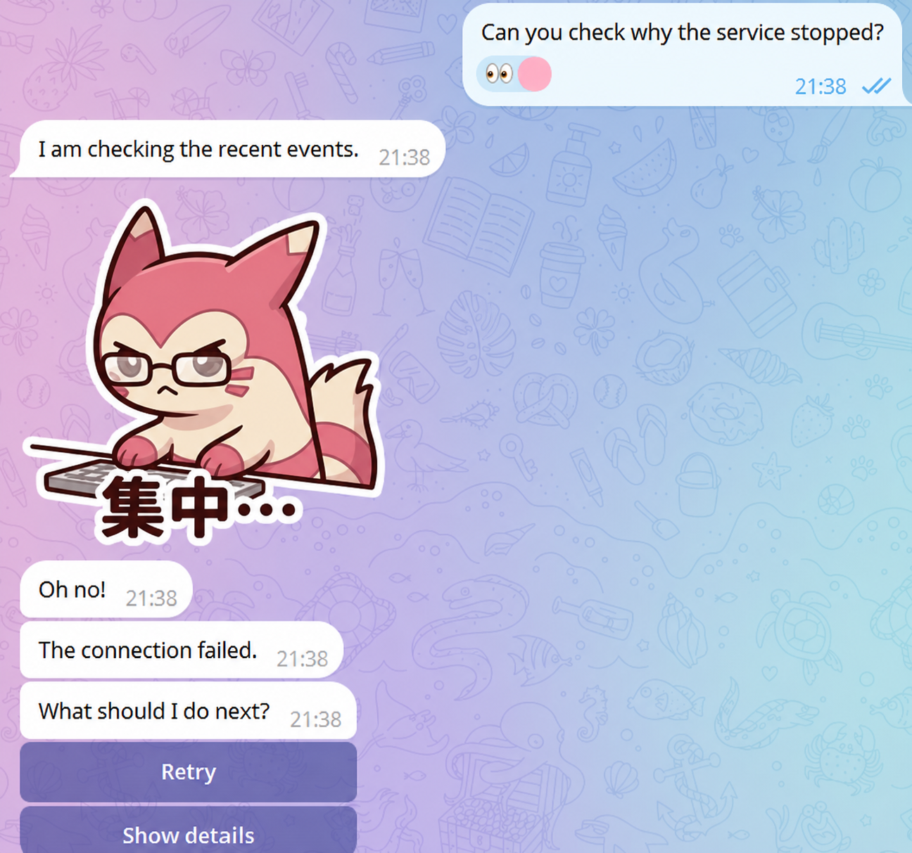

# Telemood

[简体中文](README.zh-CN.md) | [Setup Guide](SETUP.md)

Telemood is for owners already running a **model-driven Telegram Agent** with an existing Telegram Bot API runtime and client.

Start from the included dependency-free adapter facade or implement the host protocol, mapping your existing client methods into Telemood’s structured interaction kernel.

## What this looks like in Telegram

One reply can combine a reaction on the triggering message, several short
bubbles, a regular sticker, and tappable choices in a strict order:



## Quick answers

**What is Telemood?**
A dependency-free Python library that turns model plans into Telegram
bubbles, emoji reactions, regular stickers, and choice buttons with explicit
delivery receipts. Sync and async hosts are supported.

**Is this another bot or client?**
No. Telemood uses the client and update loop the host already owns. It does
not read the bot token or start a second process.

**Can I give this repository to my coding Agent?**
Yes. The Agent should inspect first, report capability gaps, and wait for
authorization before installation or host changes.

**How is it installed?**
After authorization, run `python -m pip install .` from the checkout on
Python `>=3.11`.

**What if the host is async?**
Use `AsyncInteractionKernel`, `AsyncInjectedTelegramAdapter`, and
`check_adapter(..., mode="async")`. Do not create an event-loop bridge inside
the adapter.

## Prompt for your Agent

Copy and paste this prompt to your AI Agent:

```text
Clone (or pull) https://github.com/beniedev/telemood if needed.
Inspect the repository and host runtime in read-only mode first, then report transport boundaries and capability gaps.
Keep this host as the sole owner of its Telegram client and bot token.
Do not ask for or read any bot token, and do not create a second Telegram client or update loop.
Determine whether the transport boundary is synchronous or asynchronous, then use the matching Telemood kernel, adapter, and check_adapter mode.
Do not bridge a running event loop from inside the adapter.
Run offline unit tests and a wheel build from the checkout. Do not install or modify the host before explicit human authorization.
After authorization, follow SETUP.md to install Telemood and map the existing client onto the injected-client facade or host protocol.
Only then change host code/config, send, restart, or deploy. Keep model behavior inside the reported capabilities.
```

## What Telemood Is

- Lightweight Telegram interaction kernel for model-driven action plans
- Python `>=3.11`
- `dependencies = []` means no third-party runtime dependencies, while normal Python/build tooling is still required.
- Distribution and import: `telemood`
- Harness- and SDK-neutral core

## What Telemood Is Not

- Not a standalone bot process, poller, webhook server, or scheduler
- Not a token manager or network credential store
- Not an automatic deployer, restart tool, or live monitor
- Not a Telegram media downloader
- Not a custom sticker creator or sticker-set publisher in this release
- Not a MiniApp framework or webview host in v0.1

## Core Capabilities

- Ordered actions: bubble, reaction, sticker, choices
- Per-action receipts and stop-on-non-verified execution, including valid sticker early-stop checks
- Versioned model plan (`telemood.plan.v1`, `type` discriminator) bound to host-owned context; callback TTL is host-owned
- One-shot callbacks with bounded store lifetime
- Bot-scoped `SQLiteStickerCatalog` with opaque model-visible IDs and safe `StickerModelEvent` projections
- Automatic conservative bubble splitting during plan binding
- Separate reaction-change and anonymous reaction-count subscriptions and unavailable reasons
- Sync `InteractionKernel` and async `AsyncInteractionKernel`
- Included sync/async injected-client adapters and Bot API mapping normalizers

The repository, distribution, and Python import all use the public name Telemood.

## Status and verification

Telemood `0.1.0rc1` is an early pre-release. Its contracts and adapters are
covered by synthetic offline tests, but the package has not been verified
against every Telegram SDK or host runtime; the API may still change.

Built-in inbound normalizers cover regular sticker messages, reaction
change/count updates, and message-backed callbacks. Generic text messages,
Telegram Business messages, and inline-mode callbacks are not normalized in
this release; hosts must route any additional update types themselves.

CI runs the full unit-test suite on Python 3.11, 3.12, and 3.13, builds the
wheel, checks its path allowlist and selected sensitive-content patterns, and
verifies a clean install and `import telemood`. These checks validate the
package, not a particular production deployment.

## Setup

[SETUP.md](SETUP.md) is the authoritative setup guide;
[SETUP.zh-CN.md](SETUP.zh-CN.md) is its Chinese translation. Agents with
portable skill support may additionally read
[`skills/telemood/SKILL.md`](skills/telemood/SKILL.md). The setup guide and
repository code remain authoritative. See [LICENSE](LICENSE) for the license.
